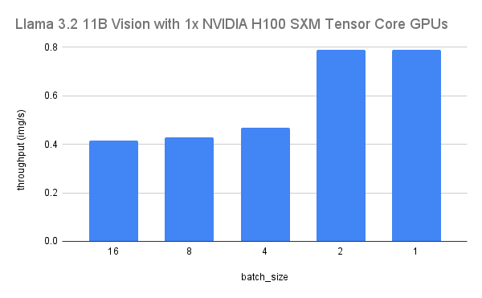
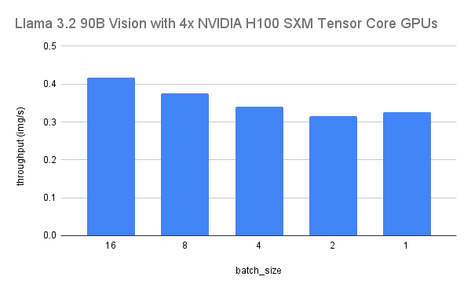

# Llama-3.2-Vision study

This repository contains the scripts and results for the Llama-3.2-Vision study. 
The study consists of two main components: qualitative testing and throughput testing.

* [Qualitative testing](qualitative/README.md)
* [Throughput testing](throughput/README.md)

## Results

### [Qualitative testing results](qualitative/report.md)
**The Llama 11B** model demonstrated reliable accuracy on simpler tasks, such as object detection, counting, and color 
identification, often providing responses that were direct and to the point. However, compared to the larger 
Llama 90B and other models like GPT-4o and Llava variants, the 11B model lacked descriptive detail and contextual 
awareness, making it less effective in generating nuanced interpretations of images.
* **Accurate at basic object detection, counting, and OCR with concise responses.**
* **Less effective at detailed scene understanding.**
* **Ideal for low-resource tasks needing quick, direct answers.**


**The Llama 90B** model stood out for its rich and comprehensive descriptions, consistently offering more context and 
background information about the scenes depicted in the images. This level of detail often surpassed other models 
like GPT-4o and Llava, which either provided concise answers or occasionally struggled with specific object 
recognition tasks. The 90B model's ability to infer additional elements, such as environmental details and object 
positions, highlighted its superior scene understanding compared to its counterparts.
* **Excels in detailed scene analysis and context-rich descriptions.**
* **Stronger commonsense reasoning and nuanced interpretations.**
* **Best for tasks requiring deep understanding, despite higher resource needs.** 


### [Throughput testing results](throughput/throughput.csv)
For the `llama-3.2-11B-Vision` model with 1 H100 SXM GPU, we found the highest throughput of 0.79 images per second, with a batch size of 1 



For the `llama-3.2-90B-Vision` model with 4 H100 SXM GPUs, we found the highest throughput of 0.42 images per second, with a batch size of 16



## Setup

Install the required dependencies by running:

```
pip install -r requirements.txt
```

Instructions for running the tests can be found in their respective README files:
* [Qualitative testing](qualitative/README.md)
* [Throughput testing](throughput/README.md)