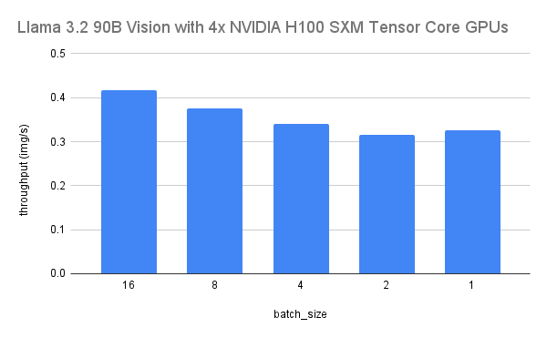

# Throughput testing

For our throughput tests, we measured the time it took each model to caption random images.

For each test, we ran the model on 256 images, of size 560x560 pixels. (This is the base tile size
for the Llama 3.2 Vision processor.)

We used the following number of GPUs for each model:
* `meta-llama/Llama-3.2-11B-Vision-Instruct`: 1 GPU
* `meta-llama/Llama-3.2-90B-Vision-Instruct`: 4 GPUs

## Results




The raw results from our testing can be found in [throughput.csv](throughput.csv).

## Running the tests

To run the throughput tests, execute the following command:
```
python test_throughput.py --num-images 256 --model <model_name> --batch-size <batch_size>
```

The script will generate a `throughput.csv` file, or append to an existing file if it already exists.